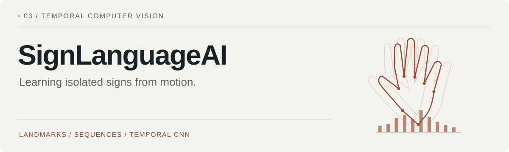
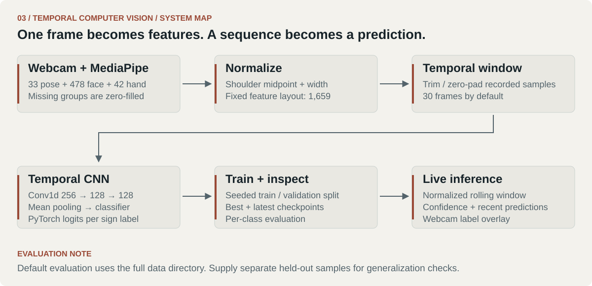
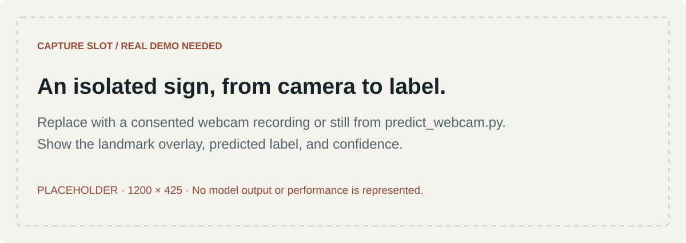

<picture>
  <source media="(prefers-color-scheme: dark)" srcset="docs/assets/portfolio/hero-dark.svg">
  
</picture>

[Colin's portfolio](https://github.com/loopedlol) · [Pipeline](#pipeline) · [Workflow](#start) · [Evaluation limits](#evaluation) · [Detailed guide](docs/WORKFLOW_GUIDE.md)

A prototype for **isolated Korean Sign Language recognition** using webcam landmarks and a PyTorch Temporal CNN. Recording, dataset inspection, normalization, training, checkpoint evaluation, and live inference are separate, inspectable stages.

<kbd>MediaPipe Tasks</kbd> <kbd>PyTorch</kbd> <kbd>OpenCV</kbd> <kbd>Isolated-sign prototype</kbd>

This project treats a sign as a short sequence of body, face, and hand features. It does not attempt sentence-level sign-language translation.

<a id="pipeline"></a>
## 01 / Motion as a sequence

<picture>
  <source media="(prefers-color-scheme: dark)" srcset="docs/assets/portfolio/system-dark.svg">
  
</picture>

Each frame has **1,659 features**: three coordinates for 33 pose landmarks, 478 face landmarks, and 21 landmarks per hand. Missing landmark groups are zero-filled. Normalization centers around the shoulder midpoint and scales by shoulder width.

The default temporal window is **30 frames**, not necessarily one second of real time. The dataset trims or pads recordings to this length. The model uses three temporal convolution blocks, mean pooling, and a classifier. See [feature extraction](src/feature_extractor.py), [normalization](src/normalize_landmarks.py), and [the model](src/model.py).

<a id="start"></a>
## 02 / Record → train → inspect

From the repository root:

```bash
python -m venv .venv
source .venv/bin/activate
python -m pip install -r requirements.txt
```

On Windows, activate with `.venv\Scripts\activate`.

You must supply a compatible MediaPipe Holistic Landmarker model at `models/holistic_landmarker.task`. The repository contains neither this detector nor a trained sign-classifier checkpoint. The installed MediaPipe package must expose the Holistic Tasks API; the [health check](src/holistic_health_check.py) diagnoses availability and model-file problems.

```bash
python src/holistic_health_check.py
python src/record_landmark_sequence.py --label hello --seconds 2
python src/inspect_dataset.py
python src/normalize_landmarks.py
python src/train.py
python src/evaluate.py
python src/predict_webcam.py
```

Record multiple samples for each of at least two sign labels before training. In the recorder, press **r** to capture a sample and **q** to exit. Training writes `checkpoints_30/best.pt`, `latest.pt`, and a label mapping.

A MediaPipe `.task` file extracts landmarks. A PyTorch `.pt` checkpoint classifies their temporal sequence; they are different models.

[The workflow guide](docs/WORKFLOW_GUIDE.md) contains all script options, diagnostics, directory conventions, and troubleshooting.

<a id="evaluation"></a>
## 03 / What evaluation does—and does not—show

Training creates a seeded sample-level train/validation split. However, **the evaluation script defaults to the entire normalized data directory**, including training samples. Its default accuracy is therefore a dataset diagnostic, not an independent test score.

For a separate check, prepare normalized, previously unseen samples in a different directory and pass it explicitly:

```bash
python src/evaluate.py --data-dir data/held_out_normalized --checkpoint checkpoints_30/best.pt
```

The held-out directory must preserve the checkpoint's complete label set and label ordering. The dataset builds its own label mapping; the evaluator warns about mismatches but does not remap labels. Keep signers and recording sessions separate when assessing generalization.

No recognition-accuracy claim is made here: trained weights and a documented independent evaluation set are not included. Camera placement, occlusion, lighting, signer variation, and limited sample diversity remain material constraints.

## 04 / Demo capture slot

<picture>
  <source media="(prefers-color-scheme: dark)" srcset="docs/assets/portfolio/demo-placeholder-dark.svg">
  
</picture>

A real recording should show the landmark overlay, predicted label, and confidence, with the tested sign labels identified. Obtain the signer's consent and remove identifying background details before publishing. [Replacement brief](docs/VISUALS.md).

The next useful work is broader recording diversity and evaluation across unseen signers and sessions, followed by analysis of which sign pairs fail and why.
---

[← Portfolio](https://github.com/loopedlol) · [Related: robot perception](https://github.com/loopedlol/CarVisionAI) · [Related: inspectable evaluation](https://github.com/loopedlol/RAGDocumentQA)

<sub>Colin / loopedlol · Field Notes · 2026</sub>
